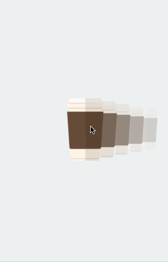

# XCarousel

## Build Status

| XBottomSheet.Touch  | XBottomSheet.Droid | .Touch.Sample  | .Droid.Sample |
| ------------- | ------------- | ------------- | ------------- |
|||||

## Preview


## Blogs

1. https://butonium.com/xamarin-carouselpicker/
2. https://alexandrustefan.com/xcarouselpicker/

## Android

#### Standard

1. Add a new XCarouselView inside your Main layout file:

```
     <XCarousel.Droid.Views.XCarouselView
            android:id="@+id/picker"
            android:background="@android:color/transparent"
            android:layout_centerInParent="true"
            android:layout_width="wrap_content"
            android:layout_height="wrap_content">
    </XCarousel.Droid.Views.XCarouselView>
```

2. In your Activity you'll need to assign a Collection to this view:

```
    var picker = FindViewById<XCarouselView>(Resource.Id.picker);
    
    var products = new List<PickerItem>();

    products.Add(new DrawableItem(Resource.Drawable.CoffeeAsset));
    products.Add(new DrawableItem(Resource.Drawable.CoffeeAsset));
    products.Add(new DrawableItem(Resource.Drawable.CoffeeAsset));
    products.Add(new DrawableItem(Resource.Drawable.CoffeeAsset));
    products.Add(new DrawableItem(Resource.Drawable.CoffeeAsset));
    products.Add(new DrawableItem(Resource.Drawable.CoffeeAsset));
    products.Add(new DrawableItem(Resource.Drawable.CoffeeAsset));

    picker.Items = products;
```

3. And for the FadeEffect to take place you'll need to assign the desired FadeColor:

```
    picker.FadeColor = "#ecf0f1";
```

## iOS

#### Standard

Note that this UICollectionView customization was designed to work with one row and horizontal scrolling. If you have a different case, create a pull request to see if we can addapt the component to more general needs.

1. Add a new UICollectionView to your view. Within Widget properties, select "XCarouselView" as you CollectionViewType.

2. Create your UICollectionViewCell. There is no known restriction on what can be in here.

3. Create your UICollectionViewDataSource.

4. Wire everything together:

```
    customCollectionView.RegisterNibForCell(CustomCollectionViewCell.Nib, CustomCollectionViewCell.Key);
    customCollectionView.DataSource = new CustomDataSource();
```

Now your project should have a UICollectionView that resembles the behaviour from the Preview gif.
